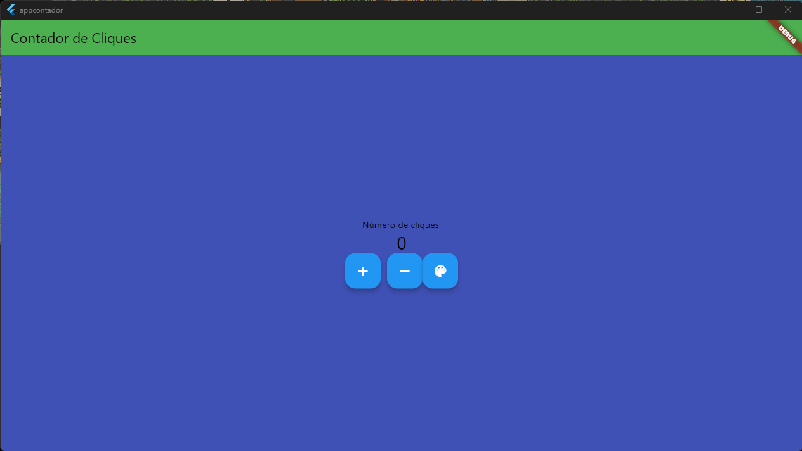

# AppContador

O objetivo deste aplicativo é permitir que um funcionário realize a contagem de pessoas entrando e saindo de um ambiente fechado, para evitar que mais pessoas do que o permitido acessem o ambiente. Este aplicativo simples foi desenvolvido como parte de um projeto introdutório ao desenvolvimento de aplicativos com o Flutter.

## Aluno

- **Matrícula:** 222100011

---

## Funcionalidades

- Contagem de pessoas que entram e saem do ambiente.
- Visualização do número total de pessoas presentes no ambiente.
- Alerta quando a capacidade máxima do ambiente é atingida.

## Desenvolvimento

Este aplicativo foi desenvolvido utilizando o framework Flutter. Ele utiliza conceitos básicos de interface de usuário e manipulação de estados para realizar a contagem e exibir as informações relevantes.

### Tecnologias Utilizadas

- **Flutter:** Framework de desenvolvimento de aplicativos multiplataforma.
- **Dart:** Linguagem de programação utilizada pelo Flutter.

### Componentes Principais

- **Scaffold:** Widget principal que implementa a estrutura básica da interface do aplicativo.
- **AppBar:** Barra superior que exibe o título do aplicativo.
- **FloatingActionButton:** Botões flutuantes para adicionar ou subtrair da contagem e alterar a cor de fundo.
- **Text:** Widget para exibir textos na interface do aplicativo.
- **Row:** Widget para organizar outros widgets em uma linha na interface.
- **Column:** Widget para organizar outros widgets em uma coluna na interface.

### Desenvolvedor

Este aplicativo foi desenvolvido por [Nome do Desenvolvedor], como parte do projeto de introdução ao Flutter.

---

Este é um projeto inicial e pode ser expandido com mais funcionalidades e melhorias de design no futuro.
